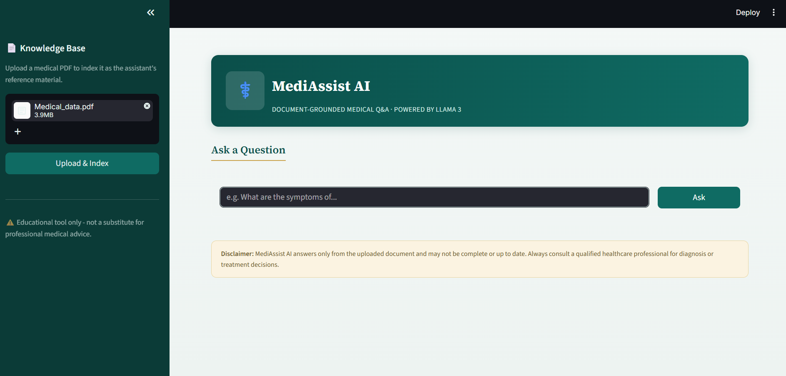
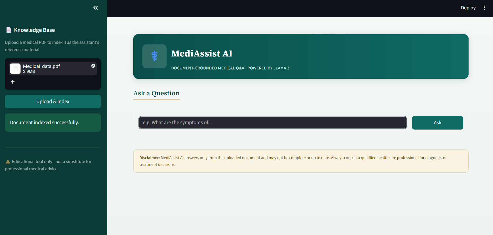
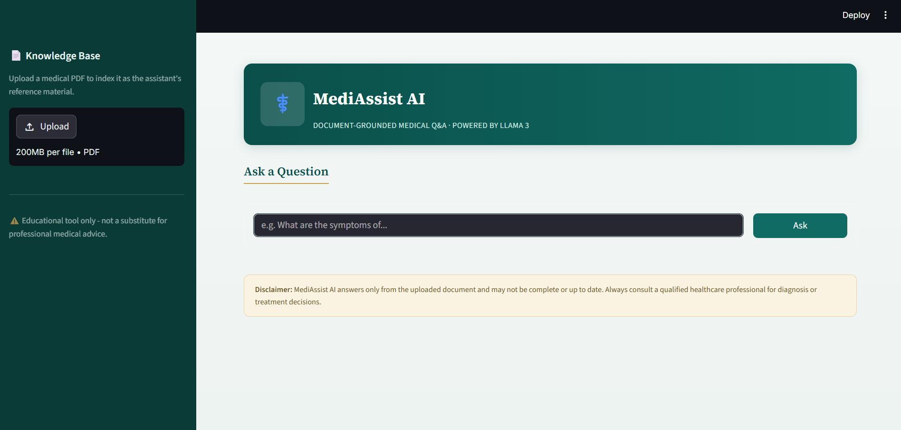
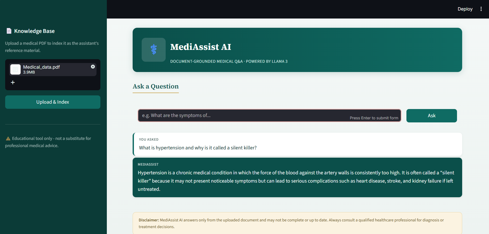

# Medical Assist


-orange)


A Retrieval-Augmented Generation (RAG) medical Q&A assistant. Upload a medical PDF, and the assistant answers questions strictly from that document using AWS Bedrock (Llama 3) for generation and embeddings, with FAISS for vector search.

**Disclaimer:** Educational tool only - not a substitute for professional medical advice.

---

## Screenshots

| Upload | Indexed Document |
|---|---|
|  |  |

| Preview | Retrieved Data |
|---|---|
|  |  |

## How it works

1. A PDF is uploaded via the Streamlit frontend and sent to the FastAPI backend.
2. The backend loads and splits the PDF (`PyPDFLoader`), embeds it using an AWS Bedrock embedding model, and stores the vectors in a local FAISS index.
3. When a question is asked, the backend retrieves the top-5 most relevant chunks from FAISS and builds a context-only prompt.
4. The prompt is sent to a Bedrock LLM (Llama 3), which is instructed to answer only from the provided context and say "I don't know" if the answer isn't present.
5. The answer and source document metadata are returned to the frontend and displayed in the chat.

---

## Tech stack

- **Backend:** FastAPI
- **Frontend:** Streamlit
- **LLM & Embeddings:** AWS Bedrock (Llama 3 for generation, Titan/Bedrock embedding model)
- **Vector store:** FAISS (local, via LangChain)
- **PDF parsing:** PyPDF (`langchain_community.document_loaders.PyPDFLoader`)
- **Other:** boto3, python-dotenv, python-multipart

## Project structure

```
Medical_assist/
├── backend/
│   ├── app/
│   │   ├── main.py            # FastAPI app entrypoint
│   │   ├── routes.py          # /upload and /ask endpoints
│   │   ├── document_loader.py # PDF loading
│   │   ├── embeddings.py      # Bedrock embeddings wrapper
│   │   ├── vector_store.py    # FAISS create/load
│   │   ├── rag_pipeline.py    # Retrieval + prompt + generation
│   │   └── config.py          # Env-based configuration
│   ├── data/                  # Uploaded PDFs
│   └── db/                    # FAISS index storage
├── frontend/
│   └── app.py                 # Streamlit chat UI
├── Screenshots/
└── requirements.txt
```

## Setup

### 1. Clone and install dependencies

```bash
git clone https://github.com/Chowdri-Furkhan07/Medical_assist.git
cd Medical_assist
pip install -r requirements.txt
```

### 2. Configure AWS Bedrock credentials

Create a `.env` file inside `backend/` with:

```
AWS_ACCESS_KEY_ID=your_access_key
AWS_SECRET_ACCESS_KEY=your_secret_key
AWS_REGION=your_aws_region
BEDROCK_MODEL_ID=your_bedrock_llm_model_id
EMBEDDING_MODEL_ID=your_bedrock_embedding_model_id
```

You'll need an AWS account with Bedrock access enabled for the chosen models.

### 3. Run the backend

```bash
cd backend
uvicorn app.main:app --reload
```

The API runs at `http://127.0.0.1:8000`, exposing:

- `POST /upload` - upload and index a PDF
- `POST /ask?query=...` - ask a question against the indexed document

### 4. Run the frontend

In a separate terminal:

```bash
cd frontend
streamlit run app.py
```

The Streamlit app expects the backend at `http://127.0.0.1:8000` (see `API_URL` in `frontend/app.py`).

## Usage

1. Open the Streamlit app.
2. Upload a medical PDF from the sidebar and click **Upload & Index**.
3. Ask questions in the chat input - answers are generated only from the uploaded document, with "I don't know" returned for anything outside its content.

## Author

**Chowdri Furkhan**
GitHub: [@Chowdri-Furkhan07](https://github.com/Chowdri-Furkhan07)

## License

This project is licensed under the MIT License - see the [LICENSE](LICENSE) file for details.
